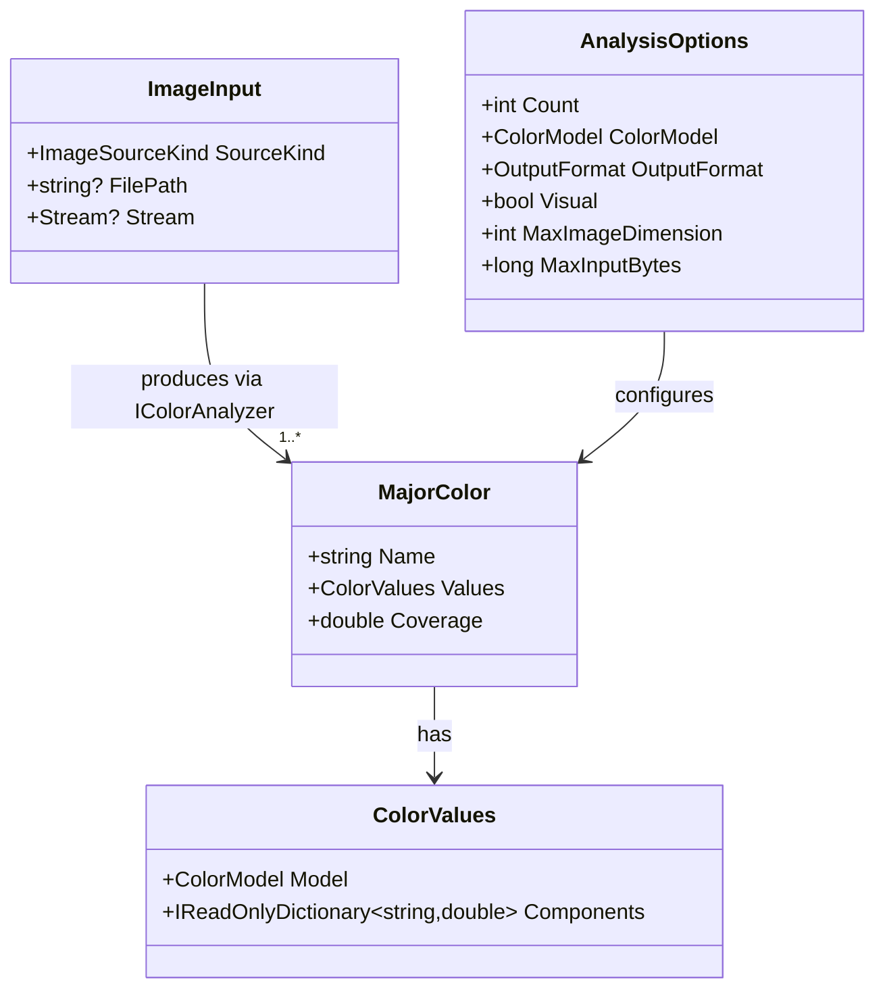

# Data Model: Image Color Analysis CLI

## Entities

### ImageInput

Represents the source from which an image is loaded.

| Field | Type | Description |
|-------|------|-------------|
| `SourceKind` | `ImageSourceKind` | `File`, `Clipboard`, or `StandardInput`. |
| `FilePath` | `string?` | Absolute or relative path when `SourceKind == File`. |
| `Stream` | `Stream?` | Open readable stream when `SourceKind == Clipboard` or `StandardInput`. |

**Validation rules**:
- Exactly one source must be resolvable. If `--clipboard` is present, `SourceKind` is `Clipboard`.
- If a file path argument is present, it takes precedence over standard input (FR-004).
- If no file path and no clipboard flag are present, `SourceKind` is `StandardInput` (FR-003).

### MajorColor

A dominant color identified in the image.

| Field | Type | Description |
|-------|------|-------------|
| `Name` | `string` | Closest named color (e.g., "Crimson"). |
| `Values` | `ColorValues` | Numeric values in the selected color model. |
| `Coverage` | `double` | Relative presence in the image, 0.0–1.0. |

**Validation rules**:
- `Coverage` must be non-negative and the sum of all reported coverages must equal 1.0 within a 1% tolerance (SC-002).
- `Name` must be non-empty; if no close named match exists, the closest name is still reported with the actual values.

### ColorValues

Container for numeric color coordinates.

| Field | Type | Description |
|-------|------|-------------|
| `Model` | `ColorModel` | `Rgb`, `Cmyk`, `Hsl`, or `Hex`. |
| `Components` | `IReadOnlyDictionary<string, double>` | Model-specific keys and values. |

**Component keys by model**:
- `Rgb`: `r`, `g`, `b` (0–255).
- `Cmyk`: `c`, `m`, `y`, `k` (0.0–1.0 or 0–100; documented in output).
- `Hsl`: `h` (0–360), `s` (0.0–1.0), `l` (0.0–1.0).
- `Hex`: `hex` (string, e.g., `#DC143C`).

### ColorModel

Enum of supported output color models.

| Value | Description |
|-------|-------------|
| `Rgb` | Default. Red, green, blue. |
| `Cmyk` | Cyan, magenta, yellow, key/black. |
| `Hsl` | Hue, saturation, lightness. |
| `Hex` | Six-digit hexadecimal with `#` prefix. |

### OutputFormat

Enum of supported output formats.

| Value | Description |
|-------|-------------|
| `Text` | Default. Human-readable lines with name, values, and coverage. |
| `Json` | Single JSON object containing a `colors` array. |
| `Jsonl` | One JSON object per color, one per line. |
| `Yaml` | YAML document with a `colors` list. |
| `Visual` | ANSI truecolor swatches; requires terminal support. |

### AnalysisOptions

User-provided options that control analysis and output.

| Field | Type | Default | Description |
|-------|------|---------|-------------|
| `Count` | `int` | `1` | Number of major colors to report (FR-014). |
| `ColorModel` | `ColorModel` | `Rgb` | Selected color model (FR-008). |
| `OutputFormat` | `OutputFormat` | `Text` | Selected output format (FR-010). |
| `Visual` | `bool` | `false` | Render visual swatches (FR-015). |
| `MaxImageDimension` | `int` | `512` | Longest edge for downscale-before-quantize. |
| `MaxInputBytes` | `long` | `100 * 1024 * 1024` | Reject inputs larger than 100 MB. |

## Relationships

## State Transitions

The CLI has no persistent state, but each invocation follows a well-defined flow:

1. **Parse** command-line arguments into `AnalysisOptions` and `ImageInput`.
2. **Validate** inputs (file exists, model/format supported, count positive, stream not empty).
3. **Load** the image through the appropriate `IImageSource`.
4. **Analyze** via `IColorAnalyzer` to produce a list of `MajorColor`.
5. **Resolve** nearest names via `IColorNameResolver`.
6. **Format** results via `IOutputWriter` selected by `OutputFormat`.
7. **Write** to stdout; errors to stderr; exit with appropriate code.

## Validation Rules Summary

| Rule | Error Behavior |
|------|----------------|
| File path does not exist or is unsupported format | stderr message, exit code 2 |
| Clipboard contains no image data | stderr message, exit code 3 |
| Standard input empty and no file/clipboard provided | stderr message, exit code 4 |
| Unsupported color model requested | list supported models, exit code 5 |
| Unsupported output format requested | list supported formats, exit code 6 |
| Visual output requested on unsupported terminal | stderr message, exit code 7 |
| Image corrupt or exceeds size limits | stderr message, exit code 8 |
| Internal or unexpected error | stderr message, exit code 1 |
| Success | stdout result, exit code 0 |
